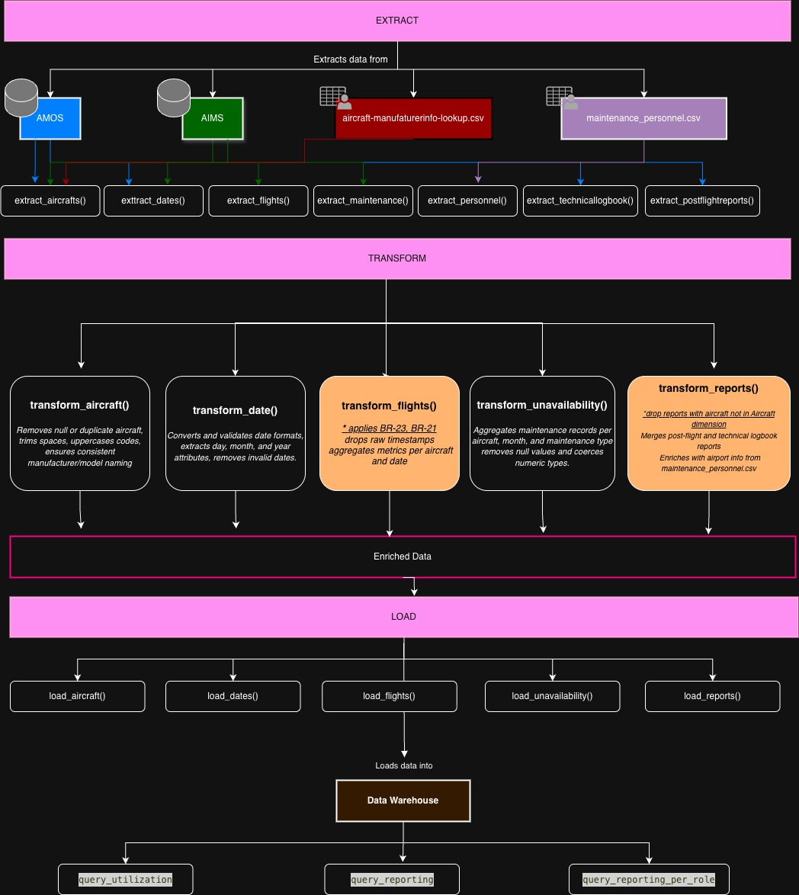
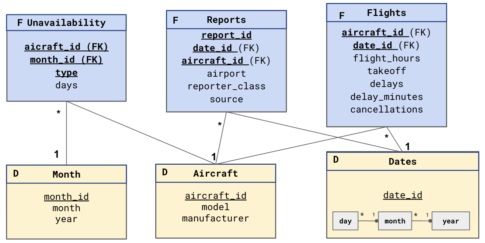

# ✈️ Aircraft Maintenance Data Warehouse

**SQL · ETL · Data Modeling · Python · DuckDB · PostgreSQL**

An end-to-end data warehouse that turns raw airline operations data into business KPIs: how much each aircraft flies, how often it is grounded for maintenance, how reliable it is, and how frequently pilots and mechanics report technical issues.

📄 **New to the project? Start with the [project overview (PDF)](docs/project_overview.pdf)** — a short, non-technical walkthrough.

---

## The problem

An airline's operational data lives in two separate systems:

- **AIMS** – flights (departures, arrivals, delays, cancellations) and maintenance slots.
- **AMOS** – technical reports written by pilots and maintenance staff.

Answering a simple question like *"How reliable were our Airbus aircraft in 2024?"* means writing long, slow queries that join both systems and recompute everything from raw timestamps every time. The data also contains errors (flights that land before they take off, overlapping flights, reports about aircraft that don't exist).

## The solution

1. **Extract** raw data from both PostgreSQL systems and two reference files.
2. **Transform**: clean it with business rules, compute flight measures, and aggregate it to the right level of detail.
3. **Load** it into an analytical warehouse (DuckDB) designed so every KPI is a short SQL query.



## Data model

A **galaxy schema**: three fact tables that share the same dimensions.



| Fact table | One row per… | What it measures |
|---|---|---|
| `Flights` | aircraft × day | flight hours, take-offs, delays, delay minutes, cancellations |
| `Unavailability` | aircraft × month × maintenance type | days out of service (scheduled / unscheduled) |
| `Reports` | individual report | who reported (pilot / maintenance), where, and from which system |

**Key design decision:** two time dimensions. Flight KPIs are defined per day, but availability KPIs are defined per month. Storing downtime monthly instead of daily avoids 30+ redundant rows per aircraft and month while still allowing daily analysis of flights.

## Data quality rules

| Rule | Problem in the source data | Fix |
|---|---|---|
| BR-23 | Arrival time earlier than departure time | Swap the timestamps before computing flight hours |
| BR-21 | Same aircraft on two overlapping flights | Discard the earlier flight |
| Unknown aircraft | Reports about aircraft not in the fleet | Discard the report |

Every correction is logged to `logs.log` for auditability, and each rule is covered by unit tests.

## KPIs computed

| Area | KPIs |
|---|---|
| Utilization | Flight hours, take-offs, daily utilization, daily cycles |
| Availability | Days out of service (scheduled, unscheduled, total), days in service |
| Reliability | Delay rate, cancellation rate, technical dispatch reliability, average delay duration |
| Reporting | Reports per 1,000 flight hours and per 100 flights — overall and by role (pilot vs. maintenance) |

All KPIs are grouped by **manufacturer and year**. Example — reporting rate per manufacturer:

```sql
WITH flight_summary AS (
    SELECT a.manufacturer, EXTRACT(year FROM f.date_id) AS year,
           SUM(f.flight_hours) AS flight_hours, SUM(f.takeoff) AS flight_cycles
    FROM Flights f JOIN Aircraft a ON f.aircraft_id = a.aircraft_id
    GROUP BY a.manufacturer, year
),
report_summary AS (
    SELECT a.manufacturer, EXTRACT(year FROM r.date_id) AS year, COUNT(*) AS report_count
    FROM Reports r JOIN Aircraft a ON r.aircraft_id = a.aircraft_id
    WHERE r.source = 'POSTFLIGHTREPORT'
    GROUP BY a.manufacturer, year
)
SELECT r.manufacturer, r.year,
       1000 * ROUND(r.report_count / NULLIF(f.flight_hours, 0), 3) AS reports_per_1000_fh,
       100  * ROUND(r.report_count / NULLIF(f.flight_cycles, 0), 2) AS reports_per_100_flights
FROM report_summary r
JOIN flight_summary f USING (manufacturer, year)
ORDER BY r.manufacturer, r.year;
```

## Tech stack

| | |
|---|---|
| Languages | SQL (PostgreSQL, DuckDB), Python |
| Libraries | pandas, NumPy, pygrametl, psycopg, pytest |
| Warehouse | DuckDB (columnar, in-process analytical database) |
| Practices | Dimensional modeling, business-rule validation, audit logging, bulk loading, unit testing |

## Repository structure

```
├── etl_control_flow.py    # Entry point: runs Extract → Transform → Load
├── extract.py             # Reads the source systems (+ baseline queries on the raw data)
├── transform.py           # Business rules, measures and aggregations
├── load.py                # Bulk loading into DuckDB
├── dw.py                  # Warehouse schema and KPI queries
├── query_test.py          # Times warehouse queries vs. baseline queries on the source
├── tests/                 # Unit tests for the data-quality rules
├── data/                  # Expected format of the reference files
└── docs/                  # Diagrams and project overview PDF
```

## Running it

```bash
python -m venv .venv && source .venv/bin/activate
pip install -r requirements.txt
pytest                         # unit tests, no database needed
```

To run the full pipeline you need access to a PostgreSQL database with the AIMS/AMOS schemas (the original one is private) and the reference files described in [`data/README.md`](data/README.md). Configure the connection by copying `db_conf.example.txt` to `db_conf.txt`, or through the environment variables `BDA_DB_NAME`, `BDA_DB_USER`, `BDA_DB_PASSWORD`, `BDA_DB_HOST`, `BDA_DB_PORT`.

```bash
python etl_control_flow.py     # builds dw.duckdb
python query_test.py           # runs and times the KPI queries
```

## Context

Academic team project (2 people) for the *Big Data Analytics* course of the Data Science and Engineering degree at Universitat Politècnica de Catalunya (UPC). The baseline queries on the raw source data were provided as part of the assignment and are used only as a performance reference.
